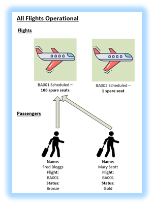
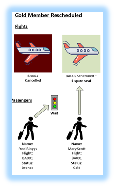
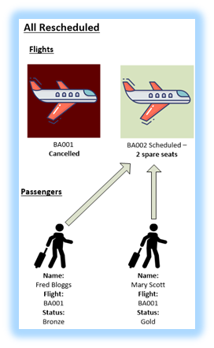
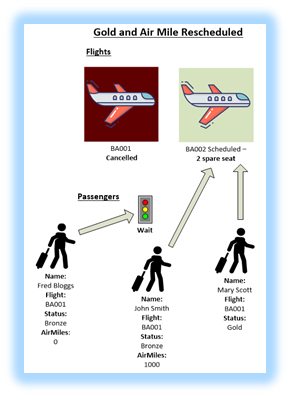

#  DMN Flight Rescheduling

## Description

Flight Rescheduling.  Example of advanced FEEL


## Edit and view project

* Open and view the project in VSC using the DMN plugin

### Running

You will need:

* Java 11+ installed
* Environment variable JAVA_HOME set accordingly
* Maven 3.5.2+ installed

#### Compile and Run in Local Dev Mode

```sh
mvn clean compile quarkus:dev
```

## API

```sh
http://localhost:8080/q/swagger-ui/#/__0019_45flight%20_45rebooking%20Resource/post_0019_flight_rebooking
```

## Scenario 1 - Flight on schedule. 

<p align="Left"></p>

```sh
{
    "Flight List": [
      {
        "Flight Number": "BA001",
        "From": "LHR",
        "To": "LAX",
        "Departure": "2023-05-16T13:54:39.329Z",
        "Arrival": "2023-05-16T13:54:39.329Z",
        "Capacity": 100,
        "Status": "scheduled"
      },
      {
        "Flight Number": "BA002",
        "From": "LHR",
        "To": "LAX",
        "Departure": "2023-05-17T13:54:39.329Z",
        "Arrival": "2023-05-17T13:54:39.329Z",
        "Capacity": 2,
        "Status": "scheduled"
      }
    ],
    "Passenger List": [
      {
        "Name": "Fred Bloggs",
        "Status": "bronze",
        "Miles": 0,
        "Flight Number": "BA001"
      },
      {
        "Name": "Mary Scott",
        "Status": "gold",
        "Miles": 10000,
        "Flight Number": "BA001"
      }
    ]
  }
```

## Scenario 2 - Flight cancelled. Gold member rescheduled. Bronze member has to wait

<p align="Left"></p>

```sh
{
    "Flight List": [
      {
        "Flight Number": "BA001",
        "From": "LHR",
        "To": "LAX",
        "Departure": "2023-05-16T13:54:39.329Z",
        "Arrival": "2023-05-16T13:54:39.329Z",
        "Capacity": 100,
        "Status": "cancelled"
      },
      {
        "Flight Number": "BA002",
        "From": "LHR",
        "To": "LAX",
        "Departure": "2023-05-17T13:54:39.329Z",
        "Arrival": "2023-05-17T13:54:39.329Z",
        "Capacity": 1,
        "Status": "scheduled"
      }
    ],
    "Passenger List": [
      {
        "Name": "Fred Bloggs",
        "Status": "bronze",
        "Miles": 0,
        "Flight Number": "BA001"
      },
      {
        "Name": "Mary Scott",
        "Status": "gold",
        "Miles": 10000,
        "Flight Number": "BA001"
      }
    ]
  }
```

## Scenario 3 - Flight cancelled. All passengers rescheduled

<p align="Left"></p>

```sh
{
    "Flight List": [
      {
        "Flight Number": "BA001",
        "From": "LHR",
        "To": "LAX",
        "Departure": "2023-05-16T13:54:39.329Z",
        "Arrival": "2023-05-16T13:54:39.329Z",
        "Capacity": 100,
        "Status": "cancelled"
      },
      {
        "Flight Number": "BA002",
        "From": "LHR",
        "To": "LAX",
        "Departure": "2023-05-17T13:54:39.329Z",
        "Arrival": "2023-05-17T13:54:39.329Z",
        "Capacity": 2,
        "Status": "scheduled"
      }
    ],
    "Passenger List": [
      {
        "Name": "Fred Bloggs",
        "Status": "bronze",
        "Miles": 0,
        "Flight Number": "BA001"
      },
      {
        "Name": "Mary Scott",
        "Status": "gold",
        "Miles": 10000,
        "Flight Number": "BA001"
      }
    ]
  }
```

## Scenario 4 - Flight on schedule. Gold and Bronze high airmile passenger rescheduled, bronze no air miles has to wait.

<p align="Left"></p>

```sh
{
    "Flight List": [
      {
        "Flight Number": "BA001",
        "From": "LHR",
        "To": "LAX",
        "Departure": "2023-05-16T13:54:39.329Z",
        "Arrival": "2023-05-16T13:54:39.329Z",
        "Capacity": 100,
        "Status": "cancelled"
      },
      {
        "Flight Number": "BA002",
        "From": "LHR",
        "To": "LAX",
        "Departure": "2023-05-17T13:54:39.329Z",
        "Arrival": "2023-05-17T13:54:39.329Z",
        "Capacity": 2,
        "Status": "scheduled"
      }
    ],
    "Passenger List": [
      {
        "Name": "Fred Bloggs",
        "Status": "bronze",
        "Miles": 0,
        "Flight Number": "BA001"
      },
      {
        "Name": "John Smith",
        "Status": "bronze",
        "Miles": 1000,
        "Flight Number": "BA001"
      },
      {
        "Name": "Mary Scott",
        "Status": "gold",
        "Miles": 10000,
        "Flight Number": "BA001"
      }
    ]
  }
```